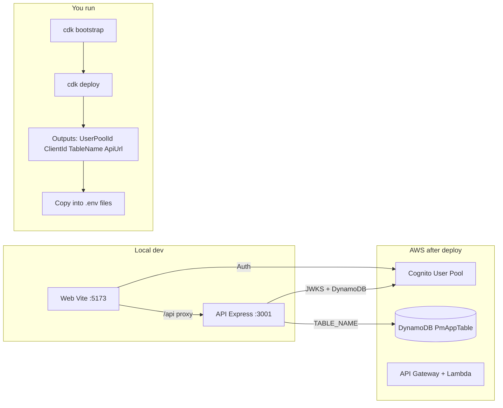

# AWS-Ready Dev Setup and Build Fixes

## App context

TaskToad is an **Asana/Jira-inspired project management** MVP: org-scoped projects and tasks with RBAC (org:admin / org:member). The repo is structured for future **AI integration** to automatically create tasks and steps; the current scope is getting the existing stack (Cognito, DynamoDB, Lambda, API Gateway, React + Vite) building, linting, and running against AWS for initial dev testing.

---

## 1. Build and package fixes

### 1.1 Build order (already documented, ensure it's reliable)

- **Issue:** API depends on `@task-toad/shared`. If shared isn't built first, `pnpm --filter api build` fails with "Cannot find module '@task-toad/shared'".
- **Current behavior:** Root `prepare` runs `pnpm --filter @task-toad/shared build`, so `pnpm install` builds shared. If someone runs only `pnpm build` without having run install (or after cleaning), the recursive build order is not guaranteed.
- **Fix:** Keep using `build:order` when building only api, or make root `package.json` `build` script explicitly build in order (e.g. shared → infra → api → web) so a single `pnpm build` always works. Recommended: change root `package.json` `build` to use the same order as `build:order` (e.g. `pnpm --filter @task-toad/shared build && pnpm -r run build` or use a small script that runs shared first, then `-r run build` excluding shared if needed).

### 1.2 Vite dev proxy target

- **Issue:** In `apps/web/vite.config.ts`, the `/api` proxy uses `target: process.env.VITE_API_URL ?? 'http://localhost:3001'`. For local dev with proxy, the **client** should use `VITE_API_URL=/api` so requests go to the same origin; the **proxy target** must always be the backend URL (`http://localhost:3001`). Using `VITE_API_URL` for both makes the proxy point at `/api` when that's set.
- **Fix:** Use a separate variable for the backend URL (e.g. `VITE_API_PROXY_TARGET` or `API_PROXY_TARGET`) defaulting to `http://localhost:3001`, and keep `VITE_API_URL` for the browser (e.g. `/api` when using proxy). Alternatively, hardcode proxy target to `http://localhost:3001` in the config and document that `VITE_API_URL` is only for the client base URL.

### 1.3 ESLint dependencies (lint script)

- **Issue:** Root `.eslintrc.cjs` uses `@typescript-eslint/parser`, `@typescript-eslint`, and `prettier` in overrides, but only `prettier` is in root `package.json`. So `pnpm lint` (which runs `eslint` in api, web, shared, infra) can fail with missing parser/plugin.
- **Fix:** Add to **root** `devDependencies`: `eslint`, `@typescript-eslint/parser`, `@typescript-eslint/eslint-plugin`, `eslint-config-prettier`. Optionally add `eslint` to each package that has a lint script; often a single set at root is enough with pnpm hoisting.

### 1.4 Verify and fix any typecheck/build failures

- After the above, run from repo root: `pnpm install`, `pnpm build`, `pnpm typecheck`, `pnpm lint`. Fix any remaining TypeScript or ESLint errors (e.g. missing types, strict options) in `apps/api`, `apps/web`, `packages/shared`, `infra`.

---

## 2. Environment variables

### 2.1 API (`apps/api/.env`)

| Variable               | Required          | Description                            |
| ---------------------- | ----------------- | -------------------------------------- |
| `PORT`                 | No (default 3001) | Local API port                         |
| `NODE_ENV`             | No                | e.g. `development`                     |
| `COGNITO_USER_POOL_ID` | Yes               | From CDK output `UserPoolId`           |
| `COGNITO_REGION`       | Yes               | AWS region (e.g. `us-east-1`)          |
| `TABLE_NAME`           | Yes               | From CDK output `TableName` (DynamoDB) |
| `AWS_REGION`           | Yes               | Same as Cognito region                 |

Copy from `apps/api/.env.example`; fill values from CDK deploy outputs.

### 2.2 Web (`apps/web/.env`)

| Variable                    | Required | Description                                                              |
| --------------------------- | -------- | ------------------------------------------------------------------------ |
| `VITE_API_URL`              | Yes      | For local dev with proxy: `/api`. Without proxy: `http://localhost:3001` |
| `VITE_COGNITO_USER_POOL_ID` | Yes      | Same as API `COGNITO_USER_POOL_ID`                                       |
| `VITE_COGNITO_CLIENT_ID`    | Yes      | From CDK output `UserPoolClientId`                                      |
| `VITE_AWS_REGION`           | Yes      | Same region (e.g. `us-east-1`)                                           |

Copy from `apps/web/.env.example`; fill from CDK outputs.

### 2.3 Optional (if you fix proxy per 1.2)

- `VITE_API_PROXY_TARGET` or similar in `apps/web` only, for Vite dev server proxy target (default `http://localhost:3001`). Not needed in production.

---

## 3. What you need to do on AWS (manual)

1. **Configure AWS CLI** (once per machine):  
   `aws configure` with an IAM user or role that has permissions to create the resources in the CDK stack (Cognito, DynamoDB, Lambda, API Gateway, S3, EventBridge, IAM).

2. **Bootstrap CDK** (once per AWS account/region):  
   From repo root:  
   `pnpm --filter infra build` then `cd infra && pnpm cdk bootstrap`  
   (Or from infra: `pnpm build && pnpm cdk bootstrap`.)

3. **Deploy the stack**:  
   From repo root: `pnpm deploy` (runs `pnpm --filter infra cdk deploy`), or from `infra`: `pnpm deploy`.  
   Approve any IAM/resource changes if prompted.

4. **Note CDK outputs** after deploy:  
   `UserPoolId`, `UserPoolClientId`, `ApiUrl`, `TableName`. These are printed in the terminal and available in AWS Console → CloudFormation → Stack → Outputs.

5. **Optional – confirm a test user (Cognito):**  
   If you sign up via the app and don't have email set up, confirm the user in AWS Console → Cognito → User pools → `task-toad-users` → Users → select user → "Confirm user".

---

## 4. What to bring from AWS into the app

| From AWS (CDK output or Console) | Where it goes                                                                                                                                                                   |
| -------------------------------- | ------------------------------------------------------------------------------------------------------------------------------------------------------------------------------- |
| **UserPoolId**                   | `apps/api/.env` → `COGNITO_USER_POOL_ID`; `apps/web/.env` → `VITE_COGNITO_USER_POOL_ID`                                                                                         |
| **UserPoolClientId**             | `apps/web/.env` → `VITE_COGNITO_CLIENT_ID`                                                                                                                                      |
| **TableName**                    | `apps/api/.env` → `TABLE_NAME`                                                                                                                                                  |
| **ApiUrl**                       | Used when calling the **deployed** API (e.g. production frontend). For **local dev**, API runs at `http://localhost:3001` and web uses `VITE_API_URL=/api` with the Vite proxy. |
| **Region**                       | Choose one (e.g. `us-east-1`) and set `COGNITO_REGION` and `AWS_REGION` in api, and `VITE_AWS_REGION` in web.                                                                   |

No secrets are required for basic dev: Cognito is used with the public client (no client secret); DynamoDB and API use the same AWS credentials as the CLI (e.g. from `aws configure` or env vars when running the API locally).

---

## 5. Initial dev test flow (after fixes and env)

1. **Install and build:**  
   `pnpm install` then `pnpm build` (or `pnpm build:order` then build rest if you keep current recursive build).

2. **Start API:**  
   `pnpm dev:api` → API at `http://localhost:3001`.

3. **Start web:**  
   `pnpm dev:web` → App at `http://localhost:5173`.

4. **Create test user:**  
   Use the app's signup at `http://localhost:5173/signup`, or create/confirm user via AWS Console or CLI (see `README.md` §7).

5. **Sign in and create org → project → task** to validate Cognito, API, and DynamoDB.

---

## 6. Summary diagram

---

## 7. Files to touch (implementation checklist)

- `package.json`: (1) Ensure `build` runs shared first or document `build:order`; (2) add ESLint + TypeScript ESLint + `eslint-config-prettier` to root `devDependencies`.
- `apps/web/vite.config.ts`: Use a dedicated proxy target (e.g. `http://localhost:3001`) or `VITE_API_PROXY_TARGET`, not `VITE_API_URL`.
- `apps/api/.env.example` / `apps/web/.env.example`: Already document the variables; optionally add a one-line comment that values come from CDK outputs.
- `README.md`: Optionally add a short "Environment variables" section that points to the two tables above and "What to bring from AWS".
- After changes: run `pnpm install`, `pnpm build`, `pnpm typecheck`, `pnpm lint` and fix any remaining errors.
